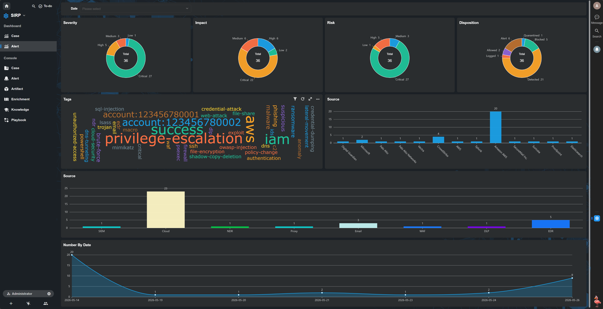
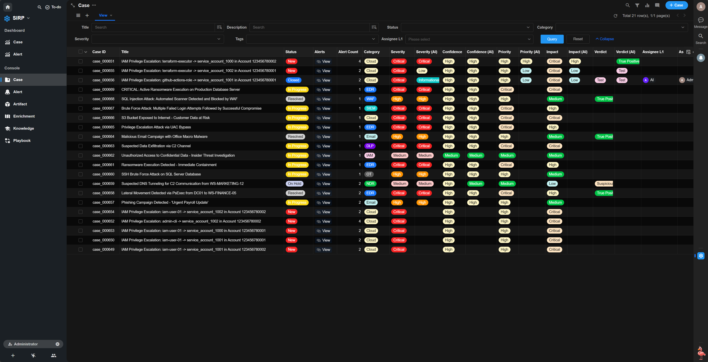
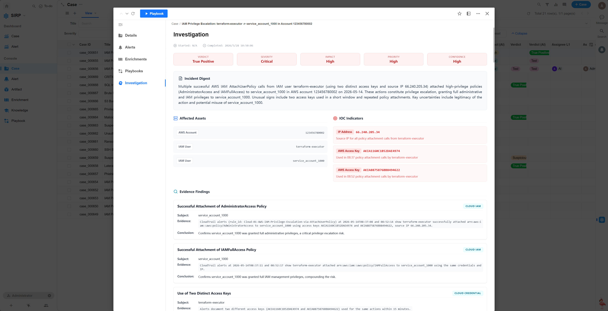
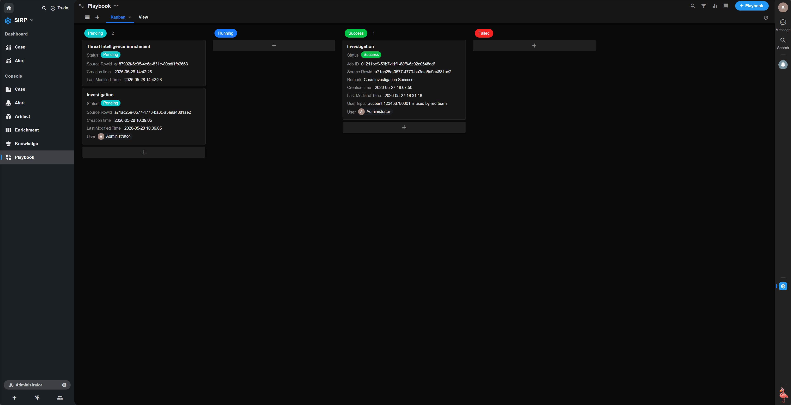
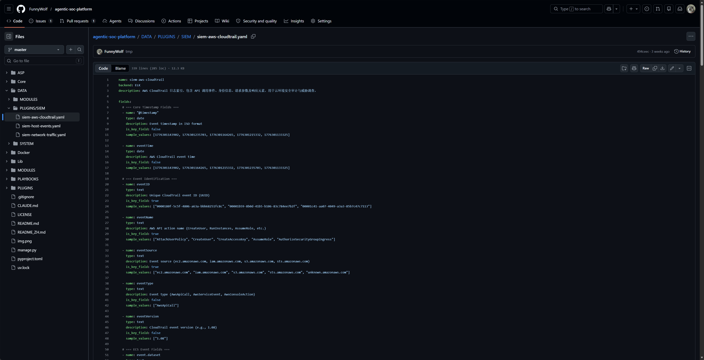
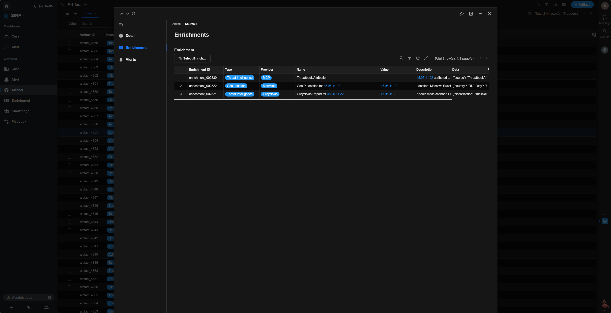
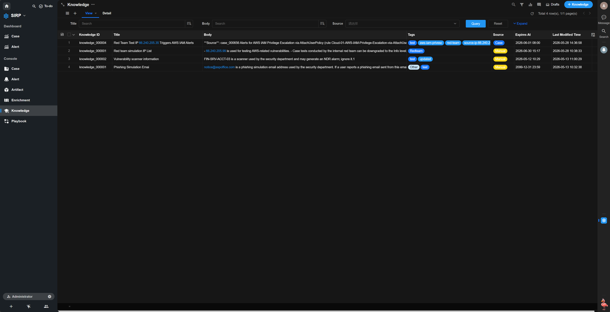

# Agentic SOC Platform

<p align="center">
  <a href="https://asp.viperrtp.com/zh/asp/Development/environment_setup/">快速部署</a> ·
  <a href="https://asp.viperrtp.com/zh/asp/Introduction/what_is_asp/">开发文档</a> ·
  <a href="https://asp.viperrtp.com/zh/sirp/Introduction/what_is_sirp/">SIRP 平台</a>
</p>

<p align="center">
    <a href="https://asp.viperrtp.com/" target="_blank">
        </a>
    <a href="https://github.com/funnywolf/agentic-soc-platform/graphs/commit-activity" target="_blank">
        </a>
    <a href="https://github.com/funnywolf/agentic-soc-platform/" target="_blank">
        </a>
    <a href="https://github.com/funnywolf/agentic-soc-platform/releases" target="_blank">
        </a>
</p>

<p align="center">
  <a href="./README.md"></a>
  <a href="./README_ZH.md"></a>
</p>

**Agentic SOC Platform** 是一个开源的安全运营平台,以 Agentic AI 为核心,让安全团队从告警疲劳中解放,专注于真正重要的安全决策.

---

### 告警自动聚合,数据降噪 99%

Module 框架持续消费 SIEM 告警,自动提取 IOC、关联聚合,千万级日志降噪至两位数案件,分析师只需关注真正重要的事.



### AI 秒级生成调查报告

LLM 自动生成调查报告,将原本需要数小时的人工分析压缩为秒级输出,报告涵盖判决、攻击链、IOC 和修复建议.



### 一键触发,自动化处置

Playbook 支持一键执行案件调查、知识提取、威胁情报富化等自动化任务,复杂流程交给 AI,分析师专注决策.



### 多 SIEM 统一接入

通过 YAML 配置统一管理 ELK、Splunk 等 SIEM 索引,一套 API 跨后端搜索,LLM 和分析师无需关心底层差异.



### 威胁情报自动富化

Artifact 创建时自动查询威胁情报提供商,将声誉评分、脉冲信息、关联恶意软件等上下文附加到 IOC,辅助分析师快速判断.



### Code Agent 深度集成

通过 MCP 协议与 Claude Code 集成,提供专业安全 Agent 和 Skill,在 AI Agent 中直接操作 Case、搜索日志、编写模块.


### 知识持续积累,越用越智能

从已关闭案件中自动提取可复用的安全知识,持续构建组织级知识库,后续案件分析越来越快、越来越准.



### 开源、私有化、纯 Python

MIT 开源许可证,全部本地化部署数据不出内网,模块/插件/Playbook 均为 Python 脚本,无技术栈壁垒.


---

## 工作流程

```
SIEM 告警 → Webhook 转发 → Redis Stream → Module 自动处理 → Case/Alert/Artifact → AI 分析报告 → 分析师决策
```

## 官方网站

[https://asp.viperrtp.com/zh/](https://asp.viperrtp.com/zh/)

## 404 星链计划


Agentic SOC Platform 现已加入 [404 星链计划](https://github.com/knownsec/404StarLink)。
