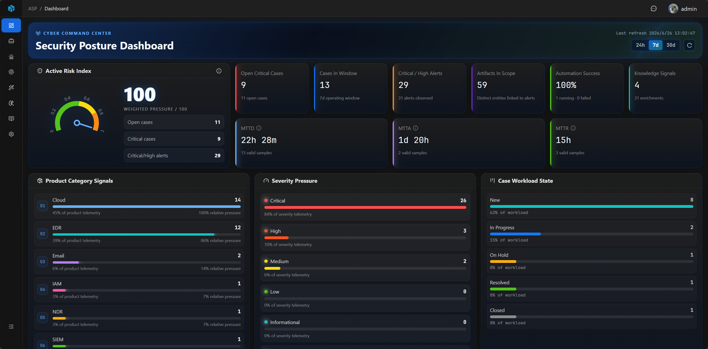

<h1 align="center">Agentic SOC Platform</h1>

  <a href="https://asp.viperrtp.com/zh/asp/quick-start/deployment/">快速开始</a> ·
  <a href="https://asp.viperrtp.com/zh/asp/overview/">了解产品</a> ·
  <a href="https://asp.viperrtp.com/zh/asp/workspace/case/">工作台功能</a>

    
    
    

  
  

**Agentic SOC Platform** 是一个开源的安全运营平台,以 Agentic AI 为核心,让 Agent 主动参与分诊、调查、富化和知识沉淀,帮助安全团队从告警疲劳走向 AI 辅助决策.

---

### 告警洪水,收敛成可处置案件

Module 流式消费 SIEM / Webhook 告警,提取 IOC、关联聚合并生成 Case、Alert、Artifact,让千万级日志最终收敛到可处置的少量案件.

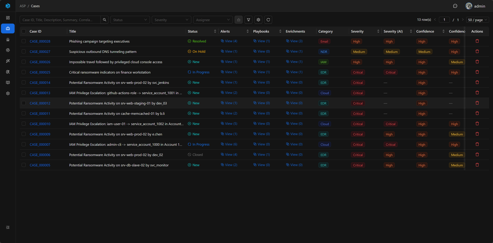

### AI 秒级生成调查报告

把数小时的人工梳理压缩成秒级输出,自动给出严重性、置信度、影响、优先级、判定和结构化调查报告.

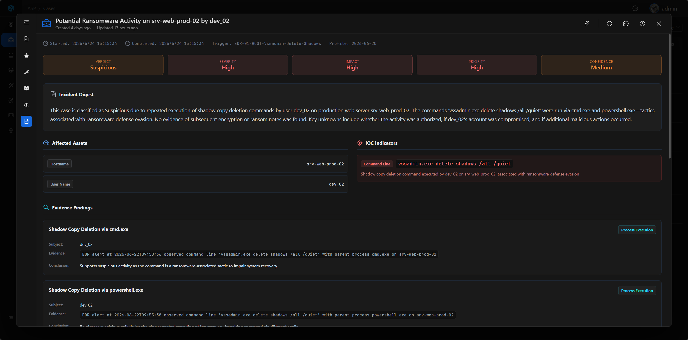

### 一键触发,复杂调查自动推进

围绕 Case 启动 LLM 调查、知识提取、威胁情报富化和 CMDB 富化,把传统 SOAR 流程和 AI 分析编排到同一套 Playbook 中.

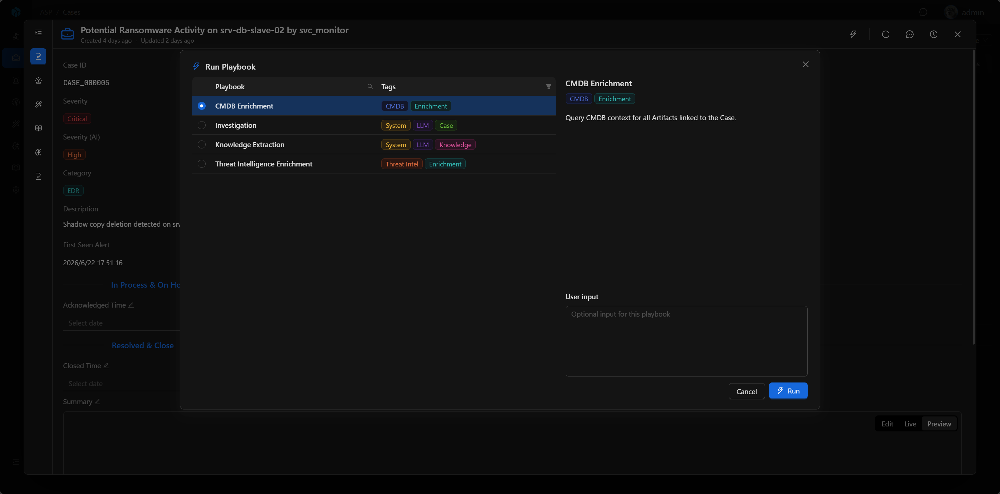

### Harness Agent 深度进入安全运营

通过 CLI 和插件向 ClaudeCode / Codex / OpenCode 等 Harness Agent 暴露 ASP 能力,让 Agent 能直接操作 Case、搜索日志、查询威胁情报、编写模块和剧本.

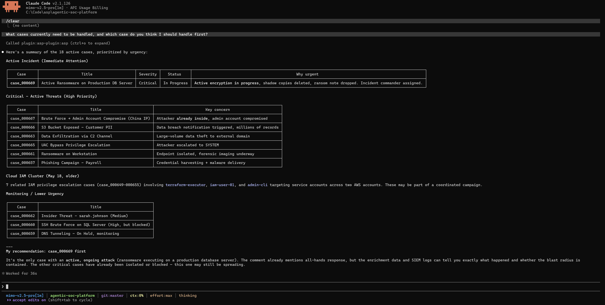

### 多 SIEM 接入,统一调查入口

支持 Splunk、ELK 配置、统一日志检索和 Webhook 告警接入,让 LLM、Agent 和分析师使用同一套安全上下文.

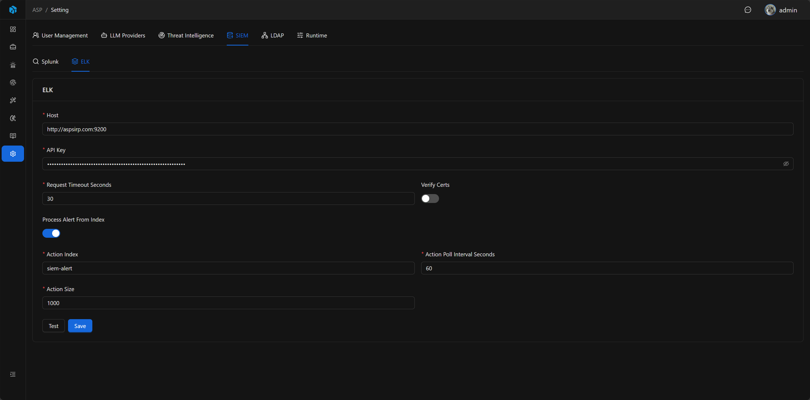

### 威胁情报自动富化

围绕 IOC 和 Artifact 自动补全声誉、脉冲、资产、身份和历史上下文,让每个可疑实体都带着判断依据出现.

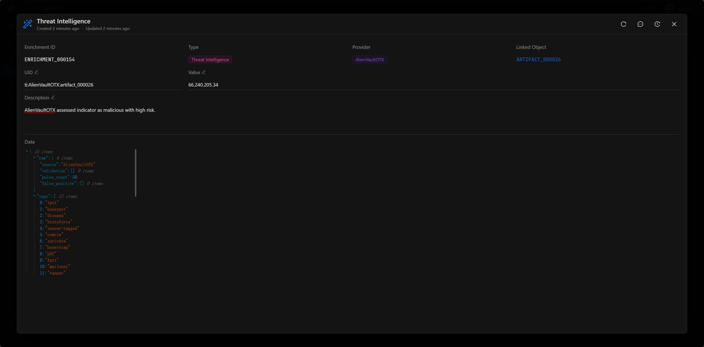

### 知识持续积累,越用越智能

从已关闭 Case 的调查记录、处置过程和讨论中提取可复用知识,让组织经验随每一次响应持续增长.

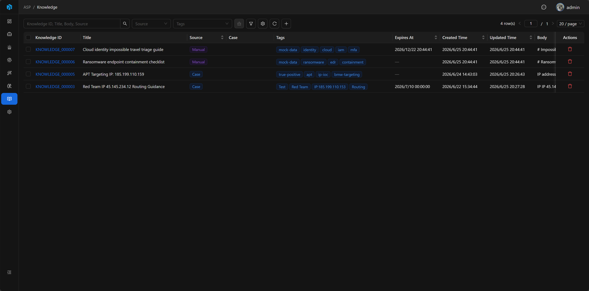

### 协作、审计和访问控制内置

本地/LDAP 登录、用户角色、API Key、Inbox 通知和 Audit Log 形成基础治理能力,安全运营不再依赖零散工具.

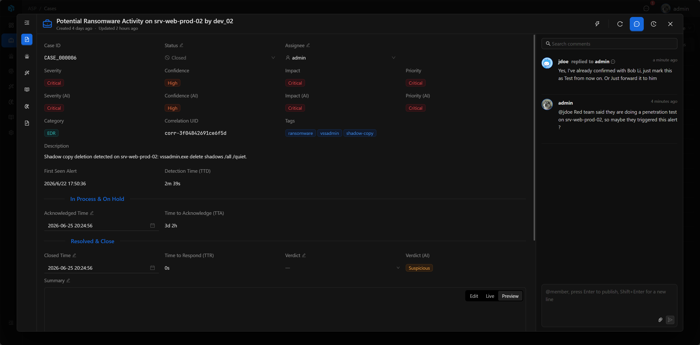

### 低成本适配,高灵活定制

用 Python 自定义 Module 适配新的 SIEM 规则和告警源,用 Playbook 编排 LLM 分析与自动化动作,让平台按你的安全场景生长.

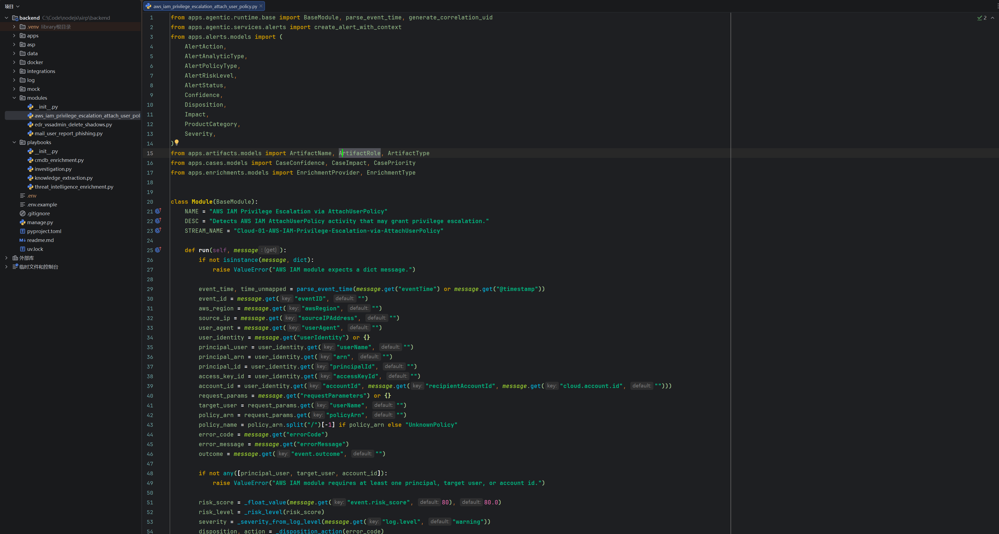

### 开源、私有化、Python & Typescript

MIT 开源许可证,支持完全本地化部署,安全数据不出内网,后端、前端和扩展脚本都清晰可控.

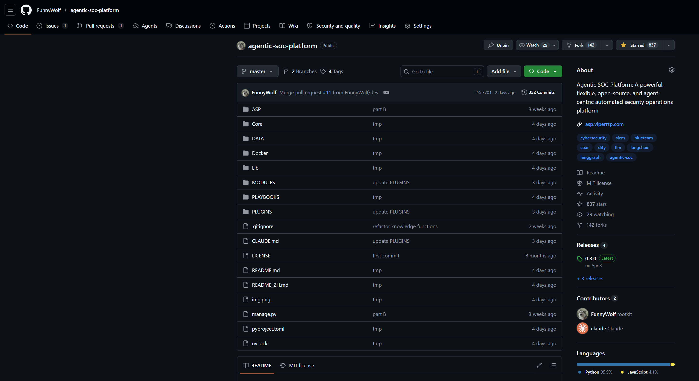

---

## 官方网站

[https://asp.viperrtp.com/zh/](https://asp.viperrtp.com/zh/)

## 404 星链计划

Agentic SOC Platform 现已加入 [404 星链计划](https://github.com/knownsec/404StarLink)。
